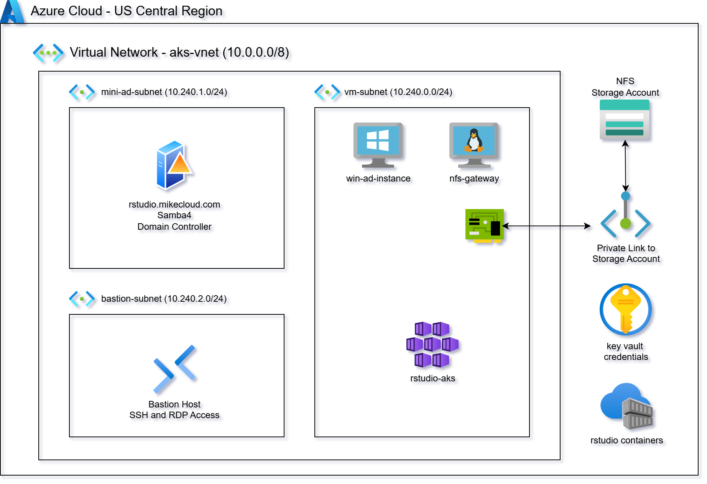
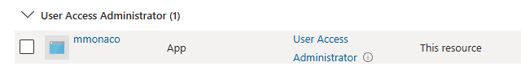
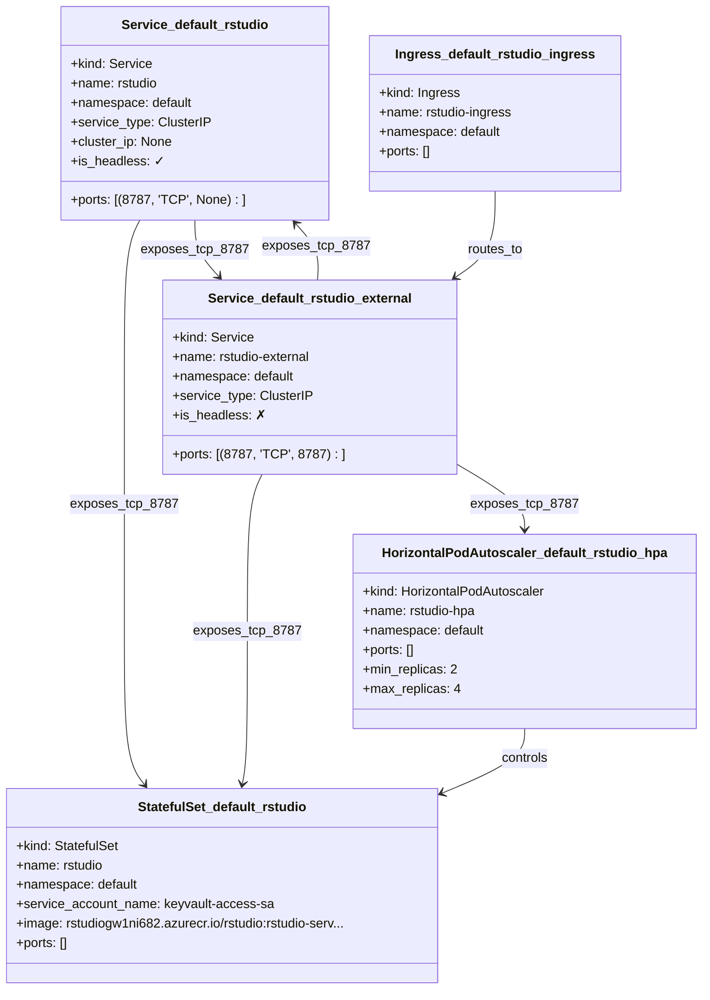

# Azure RStudio Cluster on AKS with Active Directory and Azure Files (NFS) Integration

This project builds on both the **Azure Mini Active Directory** and **RStudio VMSS Cluster** lab components to deliver a **cloud-native, domain-joined RStudio Server environment** running on **Azure Kubernetes Service (AKS)**.

  

It uses **Terraform**, **Docker**, **Helm**, and **Kubernetes manifests** to create a fully automated analytics platform that integrates with:

- **Active Directory authentication** (via a Samba-based Mini-AD Domain Controller)  
- **Azure Files NFS shares** for persistent, shared storage  
- **Azure Workload Identity + Key Vault** for secure, secretless pod-level authentication  
- **Azure Container Registry (ACR)** for hosting the custom RStudio Server image  
- A **template-driven Kubernetes manifest (`rstudio-app.yaml`)** which is rendered by Terraform and deployed via `kubectl` to provision the RStudio StatefulSet, PersistentVolume, PersistentVolumeClaim, Service, and Ingress

Unlike VM-based scaling groups, this solution deploys **containerized RStudio Server pods** on AKS that join the domain at runtime and mount **NFS volumes** for user home directories, project data, and shared R library storage.

Key capabilities demonstrated:

1. **AKS-Hosted RStudio Server** – RStudio Server (Open Source Edition) runs as containers on Azure Kubernetes Service for elasticity, self-healing, and cost-efficient scaling.  
2. **Active Directory Authentication** – Pods authenticate against a Samba-based Active Directory domain, providing centralized and consistent user identity management.  
3. **Azure Files NFS Persistent Storage** – User home folders and shared R package libraries live on Azure Files (Premium, NFS v4), ensuring cross-pod consistency and reproducible environments.  
4. **NGINX Ingress with Public IP** – Provides external HTTPS access, session affinity, customizable routing, and native Azure Load Balancer integration.  
5. **End-to-End Infrastructure as Code** – Terraform builds the AD, networking, Key Vault, NFS storage, ACR, AKS cluster, workload identities, and ingress; Docker builds the RStudio image; the **Terraform-rendered `rstudio-app.yaml` manifest is applied with `kubectl`** to deploy the full RStudio workload.

Together, these components form a scalable, domain-aware analytics platform where RStudio users share packages, data, and authentication seamlessly across a fully managed Azure Kubernetes environment.




## Prerequisites

* [An Azure Account](https://portal.azure.com/)
* [Install AZ CLI](https://learn.microsoft.com/en-us/cli/azure/install-azure-cli) 
* [Install Terraform](https://developer.hashicorp.com/terraform/install)
* [Install kubectl](https://kubernetes.io/docs/tasks/tools/)
* [Install Docker](https://docs.docker.com/engine/install/)
* [Microsoft.App](https://learn.microsoft.com/en-us/azure/container-apps/) Provider must be enabled
* `User Access Administrator` role must be assigned to build identity



If this is your first time watching our content, we recommend starting with this video: [Azure + Terraform: Easy Setup](https://www.youtube.com/watch?v=j4aRjgH5H8Q). It provides a step-by-step guide to properly configure Terraform, Packer, and the AZ CLI.

## Download this Repository

```bash
git clone https://github.com/mamonaco1973/azure-rstudio-aks.git
cd azure-rstudio-aks
```

## Build the Code

Run [check_env](check_env.sh) to validate your environment, then run [apply](apply.sh) to provision the infrastructure.

```bash
~/azure-rstudio-aks$ ./apply.sh
NOTE: Running environment validation...
NOTE: Validating that required commands are found in your PATH.
NOTE: az is found in the current PATH.
NOTE: terraform is found in the current PATH.
NOTE: docker is found in the current PATH.
NOTE: jq is found in the current PATH.
NOTE: All required commands are available.
NOTE: Checking AWS cli connection.
NOTE: Successfully logged into AWS.
NOTE: Building Active Directory instance...
Initializing the backend...
```
### Build Results

When the deployment completes, the following resources are created:

- **Networking:**  
  - A virtual network (VNet) with segmented subnets for Active Directory, AKS, Bastion, and the application tier  
  - A NAT Gateway for controlled outbound connectivity from private subnets  
  - Network Security Groups (NSGs) enforcing rules for SSH, RStudio, NFS (2049/TCP), and AD communication  
  - DNS resolution provided by the Mini Active Directory domain controller  

- **Identity, Security & Key Vault:**  
  - Azure Key Vault storing AD administrator credentials, RStudio service credentials, and deployment secrets  
  - User-assigned managed identities for AKS **Workload Identity** (replaces Kubernetes secrets)  
  - Role assignments granting pods controlled access to ACR, Key Vault, and storage resources  
  - NSG rules and identity boundaries ensuring secure, segmented communication across the environment  

- **Active Directory Domain:**  
  - A Samba-based “Mini-AD” domain controller deployed on an Azure VM  
  - Provides Kerberos, LDAP, and DNS services for the cluster  
  - Integrated with RStudio pods so users authenticate with domain credentials  

- **Azure Files (Premium NFS):**  
  - Azure Storage Account configured for **Premium FileStorage** with **NFS v4.1** shares  
  - Used as persistent backend storage for:  
    - User home directories  
    - Shared R library directories  
  - Private Endpoint + NSG rules ensure secure NFS traffic between AKS nodes and the storage account  

- **AKS Cluster & Node Pool:**  
  - Azure Kubernetes Service (AKS) cluster deployed via Terraform  
  - System and/or user node pools sized for RStudio workloads  
  - Managed Identity integration for secure ACR pulls and Key Vault access  
  - Autoscaling enabled for dynamic scheduling and cost efficiency  

- **RStudio Application:**  
  - RStudio Server (Open Source Edition) deployed as a Kubernetes StatefulSet and Service  
  - NGINX Ingress Controller provides the external entrypoint with a static Public IP  
  - Ingress routing for `/auth-sign-in` ensures proper health probes and session handling  
  - Pods join the Active Directory domain at startup and mount **Azure Files NFS** volumes for persistence  
  - Delivers high availability, reproducibility, and domain-aware multi-user access  

- **Automation & Validation:**  
  - Terraform modules orchestrate dependency ordering across networking, directory services, AKS, and application layers  
  - `apply.sh`, `destroy.sh`, and `validate.sh` automate provisioning, cleanup, and health verification  
  - Validation tests confirm AKS readiness, NGINX ingress routing, NFS mounts, and AD-backed authentication for RStudio users  

- **Sample R Workloads:**  
  - Example R scripts (Monte Carlo, bell curve, surface plotting, etc.) included to validate the environment  

### Kubernetes Components




### Users and Groups  

The domain controller provisions **sample users and groups** via Terraform templates. These are intended for testing and demonstration.  

#### Groups Created  

| Group Name    | Category  | Scope     | gidNumber |
|---------------|-----------|----------|-----------|
| rstudio-users  | Security  | Universal | 10001 |
| india         | Security  | Universal | 10002 |
| us            | Security  | Universal | 10003 |
| linux-admins  | Security  | Universal | 10004 |
| rstudio-admins  | Security  | Universal | 10005 |

#### Users Created  

| Username | Full Name   | uidNumber | gidNumber | Groups Joined                    |
|----------|-------------|-----------|-----------|----------------------------------|
| jsmith   | John Smith  | 10001     | 10001     | rstudio-users, us, linux-admins, rstudio-admins  |
| edavis   | Emily Davis | 10002     | 10001     | rstudio-users, us                 |
| rpatel   | Raj Patel   | 10003     | 10001     | rstudio-users, india, linux-admins, rstudio-admins|
| akumar   | Amit Kumar  | 10004     | 10001     | rstudio-users, india              |

### Creating a New RStudio User

Follow these steps to provision a new user in the Active Directory domain and validate their access to the RStudio cluster:

1. **Connect to the Domain Controller**  
   - Log into the **`win-ad`** server via **Bastion**
   - Use the `rpatel` or `jsmith` credentials that were provisioned during cluster deployment.  

2. **Launch Active Directory Users and Computers (ADUC)**  
   - From the Windows Start menu, open **“Active Directory Users and Computers.”**  
   - Enable **Advanced Features** under the **View** menu. This ensures you can access the extended attribute tabs (e.g., UID/GID mappings).  

3. **Navigate to the Users Organizational Unit (OU)**  
   - In the left-hand tree, expand the domain (e.g., `rstudio.mikecloud.com`).  
   - Select the **Users** OU where all cluster accounts are managed.  

4. **Create a New User Object**  
   - Right-click the Users OU and choose **New → User.**  
   - Provide the following:  
     - **Full Name:** Descriptive user name (e.g., “Mike Cloud”).  
     - **User Logon Name (User Principal Name / UPN):** e.g., `mcloud@rstudio.mikecloud.com`.  
     - **Initial Password:** Set an initial password.


5. **Assign a Unique UID Number**  
   - Open **PowerShell** on the AD server.  
   - Run the script located at:  
     ```powershell
     Z:\nfs\azure-rstudio-cluster\06-utils\getNextUID.bat
     ```  
   - This script returns the next available **`uidNumber`** to assign to the new account.  

6. **Configure Advanced Attributes**  
   - In the new user’s **Properties** dialog, open the **Attribute Editor** tab.  
   - Set the following values:  
     - `gidNumber` → **10001** (the shared GID for the `rstudio-users` group).  
     - `uid` → match the user’s AD login ID (e.g., `rpatel`).  
     - `uidNumber` → the unique numeric value returned from `getNextUID.ps1`.  

7. **Add Group Memberships**  
   - Go to the **Member Of** tab.  
   - Add the user to the following groups:  
     - **rstudio-users** → grants standard RStudio access.  
     - **us** (or other geographic/departmental group as applicable).  

8. **Validate User on Linux**  
   - Open an **Bastion** session to the **`nfs-gateway`** instance.  
   - Run the following command to confirm the user’s identity mapping:  
     ```bash
     id mcloud
     ```  
   - Verify that the output shows the correct **UID**, **GID**, and group memberships (e.g., `rstudio-users`).  


9. **Validate RStudio Access**  
   - Open the RStudio cluster’s Application Gateway's URL in a browser (e.g., `http://rstudio-cluster-xxxxx.centralus.cloudapp.azure.com/`).  
   - Log in with the new AD credentials.  

10. **Verify Permissions**  
   - By default, the new user is **not** a member of the `rstudio-admin` group.  
   - Attempting to install packages into the **shared library path `/nfs/rlibs`** should fail with a **“Permission denied”** error.  
   - This confirms the user is restricted to installing packages in their **personal user library** only.  

---

✅ **Note:** If you need the user to have administrative rights (e.g., the ability to install packages into the shared library), add them to the **rstudio-admin** group in addition to `rstudio-users`.

### Clean Up  

When finished, remove all resources with:  

```bash
./destroy.sh
```  

This uses Terraform to delete the VNet, VMs, Key Vault, storage accounts, NSGs, and secrets.  

